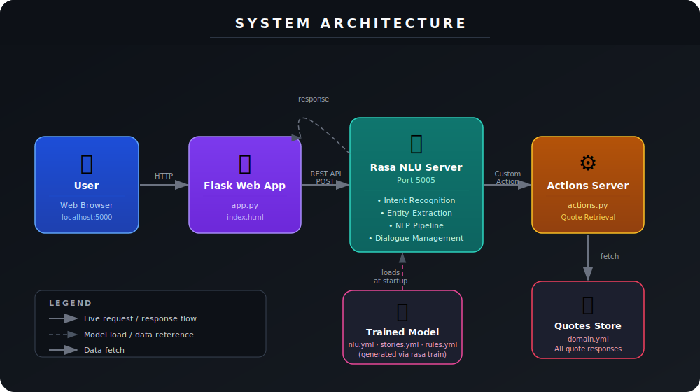
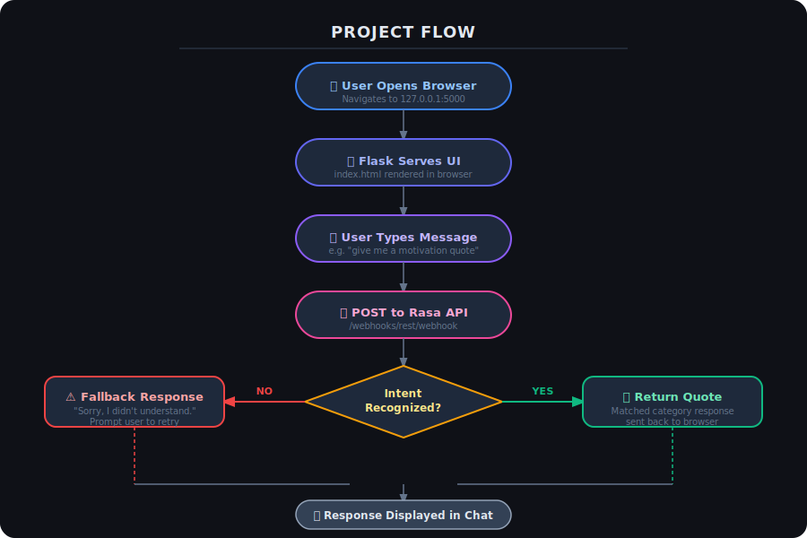

# 💬 Quotes Recommendation Chatbot

> An intelligent conversational system built with **Rasa NLU** that delivers motivational, inspirational, love, success, and humorous quotes through natural language conversations.

---

## Overview

In today's fast-paced world, people often seek quick motivation or emotional encouragement. This chatbot solves that by delivering meaningful quotes instantly through a natural conversation — no searching required.

The system understands user intent using **Natural Language Processing (NLP)** and responds with relevant quotes across multiple categories. It also includes a **web interface** so users can interact through a browser instead of the command line.

---

## Features

- 🧠 Intent recognition using **Rasa NLU**
- 📚 Quote categories: Motivation, Inspiration, Love, Success, Funny
- 🌐 Web-based chat interface
- ⚡ Real-time REST API responses
- 🔌 Easy local setup

---

## Tech Stack

| Layer | Technology |
|---|---|
| NLP Engine | Rasa NLU |
| Backend | Python, Flask |
| Frontend | HTML, CSS, JavaScript |
| API | REST |

---

## System Architecture

The diagram below shows how all components of the chatbot connect and communicate at runtime.



**Key components:**

- **Web Interface** — Flask app (`app.py`) serves the chat UI and forwards user messages to Rasa via REST
- **Rasa NLU Server** — Core engine that performs intent recognition, entity extraction, and NLP processing
- **Actions Server** — Executes custom Python logic (`actions.py`) to fetch and return appropriate quotes
- **Quotes Store** — Quote responses defined in `domain.yml`, served by the actions server
- **Trained Model** — Generated from `nlu.yml` and `stories.yml` via `rasa train`, loaded at server startup

---

## Project Flow

The diagram below shows the end-to-end flow of a single user interaction.



**Flow summary:**

1. User opens the browser at `127.0.0.1:5000`
2. Flask serves the chat interface (`index.html`)
3. User types a message (e.g. *"give me a motivation quote"*)
4. Flask POSTs the message to Rasa's REST webhook
5. Rasa classifies the intent using the trained NLP model
6. If the intent is **recognized** → the matched quote is returned
7. If the intent is **not recognized** → a fallback message prompts the user to retry
8. The response is displayed in the chat UI

---

## Prerequisites

Before getting started, make sure you have:

- **Python 3.9** (Rasa requires this specific version)
- **pip** (Python package manager)
- A terminal / command prompt

---

## Project Structure

```
quoteChatbot/
│
├── actions/
│   ├── actions.py
│   └── __init__.py
│
├── data/
│   ├── nlu.yml
│   ├── rules.yml
│   └── stories.yml
│
├── tests/
│   └── test_stories.yml
│
├── webapp/
│   ├── app.py
│   └── templates/
│       └── index.html
│
├── config.yml
├── credentials.yml
├── domain.yml
├── endpoints.yml
├── requirements.txt
├── commands.txt          # Quick reference for common CLI commands
└── README.md
```

---

## Installation & Setup

### Step 1 — Create a Virtual Environment

```bash
py -3.9 -m venv venv
```

Activate the environment:

```bash
# Windows
.\venv\Scripts\activate

# macOS/Linux
source venv/bin/activate
```

---

### Step 2 — Install Dependencies

Upgrade pip first:

```bash
python -m pip install --upgrade pip
```

Install Rasa:

```bash
pip install rasa
```

---

### Step 3 — Train the Model

```bash
rasa train
```

---

## Running the Project

You'll need **two terminals** open simultaneously.

### Terminal 1 — Start the Rasa Server

```bash
rasa run --enable-api --cors "*"
```

### Terminal 2 — Start the Web App

```bash
cd webapp
python app.py
```

### Open the Chatbot

Navigate to:

```
http://127.0.0.1:5000
```

---

## Example Interaction

```
User: hi
Bot:  Hello! I can give motivational, inspirational, love, funny, or success quotes. What do you want?

User: give me motivation
Bot:  Your only limit is your mind.

User: something about love
Bot:  Love is composed of a single soul inhabiting two bodies.

User: bye
Bot:  Goodbye! Stay positive.
```

---

## Testing

Run automated model tests:

```bash
rasa test
```

Test interactively in the terminal:

```bash
rasa shell
```

---

## Future Improvements

- [ ] Integration with messaging platforms (WhatsApp, Telegram)
- [ ] More quote categories (mindfulness, leadership, etc.)
- [ ] Sentiment analysis for context-aware responses
- [ ] Voice interaction support

---

## Authors

**Team Project — SmartBridge Experiential Learning Program**

- Vansh Malhotra
- Varun Gaikwad
- Vedika Tandulwadkar
- Vidisha Jain
